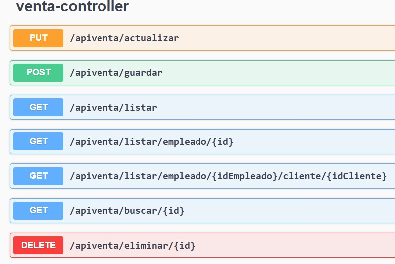
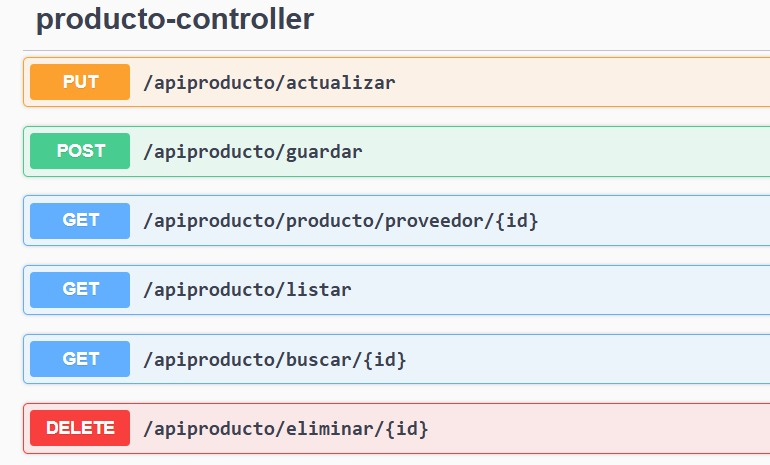
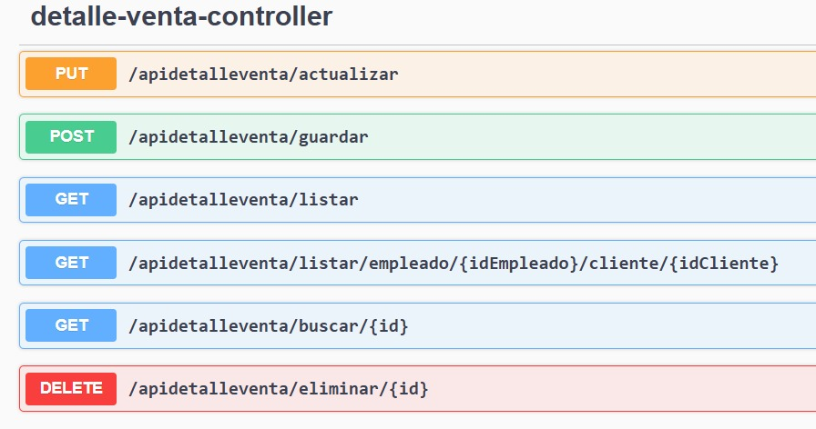
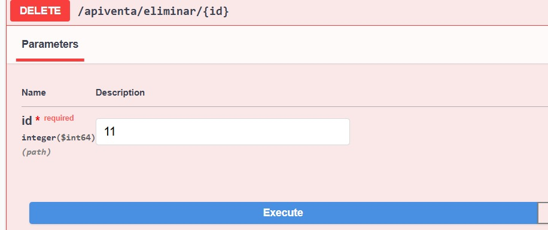
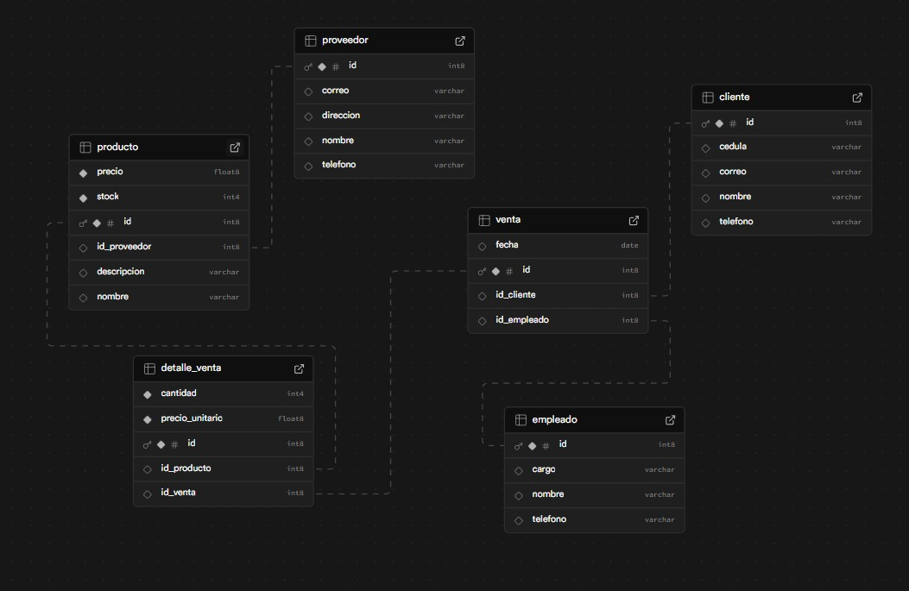

# 📚 Papelería API - Proyecto Spring Boot

## 📑 Tabla de Contenido

- [📌 Descripción](#📌-descripción)
- [🧱 Arquitectura del Proyecto](#🧱-arquitectura-del-proyecto)
- [🧠 ¿Que son las consultas nativas y como funcionan?](#🧠-¿que-son-las-consultas-nativas-y-como-funcionan)
- [🔍 Consultas nativas en el repositorio Venta](#consultas-nativas-en-el-repositorio-venta)
- [🔍 Consulta nativa en el repositorio Producto](#consulta-nativa-en-el-repositorio-producto)
- [🔍 Consulta nativa en el repositorio DetalleVenta](#consulta-nativa-en-el-repositorio-detalleventa)
- [📮 Documentacion de Endpoints Entidad Venta](#documentacion-de-endpoints---entidad-venta)
- [🗺️ Diagrama de BD en SUPABASE](#diagrama-de-bd-en-supabase)

## 📌 Descripción

Este proyecto consiste en una API RESTful para la gestión de productos, proveedores y detalles de venta en una papelería, implementado con Spring Boot, JPA y consultas nativas.

## 🧱 Arquitectura del Proyecto

Este proyecto sigue la arquitectura Model - Repository - Service - Controller (MRSC), que permite una separación clara de responsabilidades:

Model: Representa las entidades o clases que reflejan las tablas de la base de datos (Producto`, `Cliente`, `Empleado`, `Venta`, `DetalleVenta`, `Proveedor`).

Repository: Interfaces que extienden JpaRepository o usan consultas nativas para interactuar directamente con la base de datos.

Service: Lógica de negocio. Aquí se gestionan las validaciones y el flujo de datos entre el controlador y el repositorio.

Controller: Exposición de los endpoints REST que consumen los servicios para interactuar con el cliente (Swagger/Postman/etc).

## 🧠 ¿Que son las consultas nativas y como funcionan?

#### ¿Que son?

Las consultas nativas son sentencias SQL escritas directamente en el lenguaje propio del gestor de base de datos (por ejemplo, MySQL o PostgreSQL), y se ejecutan tal como están sin ser traducidas por JPQL (Java Persistence Query Language).

#### ✅ ¿Por qué usar consultas nativas?

Mayor control sobre el rendimiento y la optimización.

Uso de funciones específicas del motor SQL.

Para operaciones complejas que no pueden representarse fácilmente en JPQL.

#### 🛠️ ¿Cómo se usan en Spring Boot?

~~~
@Query(value = "SELECT * FROM productos WHERE precio > ?1", nativeQuery = true)
List<Producto> buscarProductosPorPrecioMayor(double precio);
~~~

@Query: Define la consulta.

nativeQuery = true: Especifica que se trata de una consulta nativa.

Para este ejercicio se utilizaron 4 consultas nativas

## Consultas nativas en el repositorio **Venta**

~~~
    @Query(value = "SELECT * FROM Venta WHERE id_empleado = :IdEmpleado", nativeQuery = true)
    List<Venta> listarVentasPorEmpleado(@Param("IdEmpleado") long IdEmpleado);
~~~

Esta consulta nativa recupera todas las ventas realizadas por un empleado específico, usando su ID.

Sirve para obtener el historial de ventas asociadas a un vendedor/empleado. Por ejemplo, si deseas saber cuántas ventas ha hecho el empleado con id = 3, esta consulta te da esa lista completa.

📍 Ruta en Swagger o Postman:

"apiventa/listar/empleado/{id}"

📦 Ejemplo de respuesta:

~~~
[
  {
    "id": 9,
    "fecha": "2024-04-01",
    "cliente": {
      "id": 3,
      "nombre": "Andrés Torres",
      "cedula": "1098765432",
      "telefono": "3123456789",
      "correo": "andres.torres@mail.com"
    },
    "empleado": {
      "id": 1,
      "nombre": "Marta Rodríguez",
      "cargo": "Cajera",
      "telefono": "3181234567"
    }
  },
  {
    "id": 3,
    "fecha": "2024-12-01",
    "cliente": {
      "id": 3,
      "nombre": "Andrés Torres",
      "cedula": "1098765432",
      "telefono": "3123456789",
      "correo": "andres.torres@mail.com"
    },
    "empleado": {
      "id": 1,
      "nombre": "Marta Rodríguez",
      "cargo": "Cajera",
      "telefono": "3181234567"
    }
  }
]
~~~

~~~
    @Query(value = "SELECT * FROM Venta WHERE id_empleado = :IdEmpleado AND id_cliente = :IdCliente", nativeQuery = true)
    List<Venta> listarVentasEmpleadoPorCliente(@Param("IdEmpleado") long IdEmpleado, @Param("IdCliente") long IdCliente);
~~~

Esta consulta permite filtrar las ventas realizadas por un empleado a un cliente en particular. Es útil si deseas identificar relaciones cliente-vendedor más estrechas.

📍 Ruta en Swagger o Postman:

"apiventa/listar/empleado/{idEmpleado}/cliente/{idCliente}"

📦 Ejemplo de respuesta:
~~~
[
  {
    "id": 4,
    "fecha": "2024-04-04",
    "cliente": {
      "id": 4,
      "nombre": "Diana Martínez",
      "cedula": "1012345678",
      "telefono": "3134567890",
      "correo": "diana.martinez@mail.com"
    },
    "empleado": {
      "id": 3,
      "nombre": "Ana Morales",
      "cargo": "Vendedora",
      "telefono": "3203456789"
    }
  }
]
~~~

## Consulta nativa en el repositorio **Producto**

~~~
@Query(value = "SELECT * FROM Producto WHERE id_proveedor = :IdProveedor", nativeQuery = true)
List<Producto> listarProductosPorProveedor(@Param("IdProveedor") long id);
~~~

Esta consulta recupera todos los productos que han sido suministrados por un proveedor específico, usando el id del proveedor como parámetro.

🔧 Ruta para probar en Postman o Swagger:

apiproducto/producto/proveedor/{id}

📦 Ejemplo de respuesta:

~~~
[
  {
    "id": 2,
    "nombre": "Lapicero Azul",
    "descripcion": "Lapicero tinta azul marca Bic.",
    "precio": 1200,
    "stock": 500,
    "proveedor": {
      "id": 2,
      "nombre": "Suministros Escolar",
      "telefono": "3112345678",
      "correo": "escolar@suministros.com",
      "direccion": "Calle 45 #12-34, Bogotá"
    }
  },
  {
    "id": 9,
    "nombre": "Caja de lapices",
    "descripcion": "Caja de lapices x12",
    "precio": 45000,
    "stock": 60,
    "proveedor": {
      "id": 2,
      "nombre": "Suministros Escolar",
      "telefono": "3112345678",
      "correo": "escolar@suministros.com",
      "direccion": "Calle 45 #12-34, Bogotá"
    }
  },
  {
    "id": 10,
    "nombre": "Caja de borradores",
    "descripcion": "Caja de borradores x100",
    "precio": 250000,
    "stock": 90,
    "proveedor": {
      "id": 2,
      "nombre": "Suministros Escolar",
      "telefono": "3112345678",
      "correo": "escolar@suministros.com",
      "direccion": "Calle 45 #12-34, Bogotá"
    }
  }
]
~~~

## Consulta nativa en el repositorio **DetalleVenta**

~~~
    @Query(value = "SELECT dv.* FROM Detalle_Venta dv INNER JOIN Venta v ON dv.id_venta = v.id WHERE v.id_empleado = :idEmpleado AND v.id_cliente = :idCliente", nativeQuery = true)
    List<DetalleVenta> obtenerDetallesPorEmpleadoYCliente(@Param("idEmpleado") long idEmpleado, @Param("idCliente") long idCliente);
~~~

Esta consulta obtiene los detalles de las ventas (productos, cantidades, precios, etc.) realizadas por un empleado específico a un cliente específico, haciendo uso de un INNER JOIN entre la tabla Detalle_Venta y Venta.

🔧 Ruta para probar en Postman o Swagger:

apidetalleventa/listar/empleado/{idEmpleado}/cliente/{idCliente}"

📦 Ejemplo de respuesta:

~~~
[
  {
    "id": 3,
    "venta": {
      "id": 3,
      "fecha": "2024-04-03",
      "cliente": {
        "id": 3,
        "nombre": "Andrés Torres",
        "cedula": "1098765432",
        "telefono": "3123456789",
        "correo": "andres.torres@mail.com"
      },
      "empleado": {
        "id": 1,
        "nombre": "Marta Rodríguez",
        "cargo": "Cajera",
        "telefono": "3181234567"
      }
    },
    "producto": {
      "id": 3,
      "nombre": "Borrador de nata",
      "descripcion": "Borrador blanco para lápiz.",
      "precio": 800,
      "stock": 300,
      "proveedor": {
        "id": 3,
        "nombre": "OfiProveedores",
        "telefono": "3123456789",
        "correo": "contacto@ofiproveedores.com",
        "direccion": "Av. Siempre Viva #123, Medellín"
      }
    },
    "cantidad": 5,
    "precio_unitario": 850
  }
]
~~~

## Documentacion de Endpoints - Entidad Venta

A continuación se describen los endpoints disponibles para interactuar con el sistema. Todos pueden ser probados desde Swagger o Postman según prefieras.

### 1. Crear una venta

Método: POST

Ruta: /apiventa/crear

Body (JSON):

~~~
{
  "fecha": "2024-09-15",
  "cliente": { "id": 4 },
  "empleado": { "id": 8 }
}
~~~

Respuesta esperada

~~~
{
  "id": 11,
  "fecha": "2024-09-15",
  "cliente": {
    "id": 4,
    "nombre": null,
    "cedula": null,
    "telefono": null,
    "correo": null
  },
  "empleado": {
    "id": 8,
    "nombre": null,
    "cargo": null,
    "telefono": null
  }
}
~~~

### 2. Listar todas las ventas

Método: GET

Ruta: /apiventa/listar

~~~
[
  {
    "id": 1,
    "fecha": "2024-04-01",
    "cliente": {
      "id": 1,
      "nombre": "Carlos Ruiz",
      "cedula": "1032456789",
      "telefono": "3101234567",
      "correo": "carlos.ruiz@mail.com"
    },
    "empleado": {
      "id": 2,
      "nombre": "Luis Fernández",
      "cargo": "Administrador",
      "telefono": "3192345678"
    }
  },
  {
    "id": 2,
    "fecha": "2024-04-02",
    "cliente": {
      "id": 2,
      "nombre": "Laura Gómez",
      "cedula": "1056789012",
      "telefono": "3112345678",
      "correo": "laura.gomez@mail.com"
    },
    "empleado": {
      "id": 4,
      "nombre": "Jorge López",
      "cargo": "Repartidor",
      "telefono": "3214567890"
    }
  },
  {
    "id": 4,
    "fecha": "2024-04-04",
    "cliente": {
      "id": 4,
      "nombre": "Diana Martínez",
      "cedula": "1012345678",
      "telefono": "3134567890",
      "correo": "diana.martinez@mail.com"
    },
    "empleado": {
      "id": 3,
      "nombre": "Ana Morales",
      "cargo": "Vendedora",
      "telefono": "3203456789"
    }
  },
  {
    "id": 5,
    "fecha": "2024-04-05",
    "cliente": {
      "id": 5,
      "nombre": "Felipe Castillo",
      "cedula": "1023456789",
      "telefono": "3145678901",
      "correo": "felipe.castillo@mail.com"
    },
    "empleado": {
      "id": 5,
      "nombre": "Camila Torres",
      "cargo": "Auxiliar de ventas",
      "telefono": "3225678901"
    }
  },
  {
    "id": 6,
    "fecha": "2024-04-06",
    "cliente": {
      "id": 6,
      "nombre": "Sandra López",
      "cedula": "1067890123",
      "telefono": "3156789012",
      "correo": "sandra.lopez@mail.com"
    },
    "empleado": {
      "id": 7,
      "nombre": "Lucía Sánchez",
      "cargo": "Supervisora",
      "telefono": "3247890123"
    }
  },
  {
    "id": 7,
    "fecha": "2024-04-07",
    "cliente": {
      "id": 7,
      "nombre": "Julián Ramírez",
      "cedula": "1089012345",
      "telefono": "3167890123",
      "correo": "julian.ramirez@mail.com"
    },
    "empleado": {
      "id": 6,
      "nombre": "Ricardo Gómez",
      "cargo": "Auxiliar de ventas",
      "telefono": "3236789012"
    }
  },.......
~~~

### 3. Eliminar una venta por ID

Método: DELETE

Ruta: /apiventa/eliminar/{id}

### 4. Actualizar una venta
Método: PUT

Ruta: /apiventa/actualizar

Body (JSON):

~~~
{
  "id": 3,  
  "fecha": "2024-12-01",
  "cliente": { "id": 3 },
  "empleado": { "id": 1 }
}    
~~~

Respuesta esperada

~~~
{
    "id": 3,
    "fecha": "2024-12-01",
    "cliente": {
        "id": 3,
        "nombre": "Andrés Torres",
        "cedula": "1098765432",
        "telefono": "3123456789",
        "correo": "andres.torres@mail.com"
    },
    "empleado": {
        "id": 1,
        "nombre": "Marta Rodríguez",
        "cargo": "Cajera",
        "telefono": "3181234567"
    }
}
~~~

## Diagrama de BD en SUPABASE

